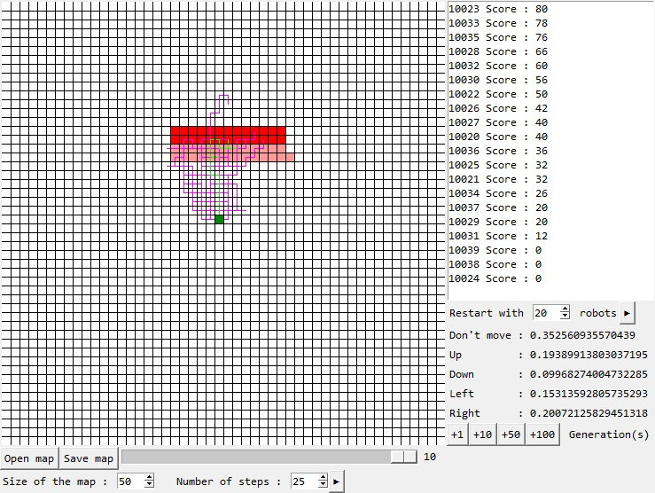

# Python-Robot-Test-Learning

This is a program that train robots to find the best path to get points.
## Features
- Save and load map
- Possibility to launch various numbers of robots generations
- Possibility to set the number of robots for each generation
- Possibility to set map size
- Possibility to set the number of robots actions for each generation
## Installation
1. Download the repository by clicking on `Code > Download ZIP`
2. Extract the ZIP file
3. Run `main.pyw`
## Requirements
- Python 3.7
- Python tkinter library
- Python random library
## Usage
You can create a map using the `LEFT` mouse button and to set the cells values you have to use to potentiometer.

In the right section you can see the list of current robots with their scores and by clicking on one of them you can see at the bottom of the section its probabilities of actions.